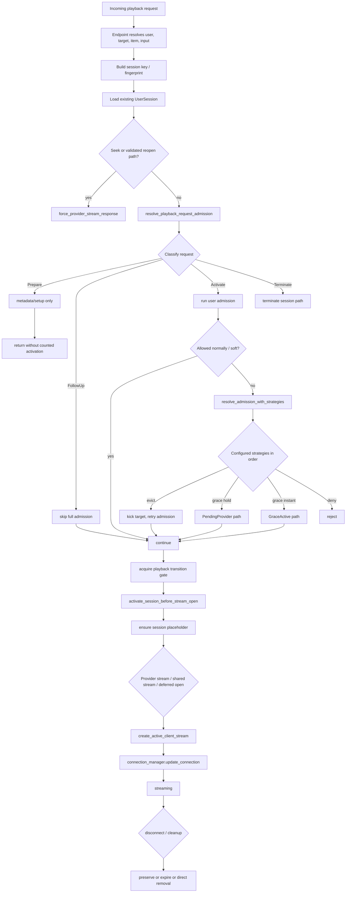
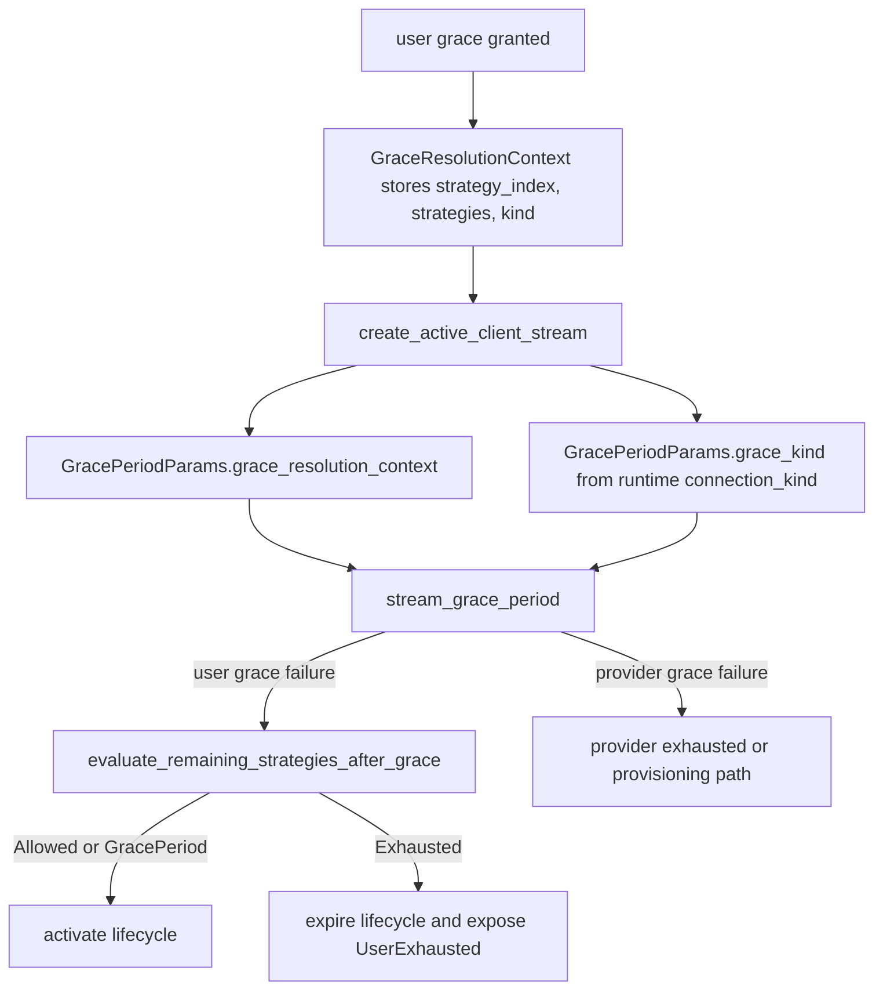

# Connection Handling Runtime Internals

This page documents the **current runtime implementation** of admission and playback activity flow in Tuliprox.

It is written for developers and maintainers.

If you want the operator-facing explanation first, read:

- [Connection Handling Runtime Flow](./connection-handling-runtime-flow.md)

## Scope

This page describes the currently implemented runtime flow as it exists today.

It is intentionally about the current code path, not the pure target-state design.

Primary implementation areas:

- `backend/app/src/api/api_utils.rs`
- `backend/app/src/api/model/active_user_manager.rs`
- `backend/app/src/api/model/streams/active_client_stream.rs`
- `backend/app/src/api/endpoints/m3u_api.rs`
- `backend/app/src/api/endpoints/xtream_api.rs`
- `backend/app/src/api/endpoints/hls_api.rs`

## Why this page exists

The runtime already contains major state-machine-style pieces:

- request classification
- session placeholders
- follow-up fast paths
- pending-provider state
- grace transitions
- transition serialization

But the real code path still spans several components and protocol-specific branches. This page is the implementation-oriented overview.

## Runtime summary

The current code path behaves roughly like this:

1. endpoint resolves user, input, target, item, and playback identity
2. existing session is loaded if present
3. special reopen/seek path may bypass ordinary admission
4. otherwise request classification decides between `Prepare`, `Activate`, `FollowUp`, `Terminate`
5. admission is resolved before stream open
6. a session placeholder may be created before provider acquisition
7. provider stream is opened, deferred, reused, or rejected
8. active stream visibility is published during connection update
9. cleanup either removes, preserves, expires, or reactivates playback state

## Activity diagram

## 1. Endpoint entry and playback identity

The concrete playback endpoints are:

- `m3u_api.rs`
- `xtream_api.rs`
- `hls_api.rs`

They all first do the same broad work:

1. resolve user and target
2. resolve item / virtual id / input
3. derive a playback/session key
4. load an existing `UserSession` if present

Session identity differs by protocol:

- catchup uses its own key namespace
- HLS may recover the session token from rewritten tokens
- other playback uses the generic session fingerprint path

## 2. Early reopen / seek path

Before ordinary admission, some existing-session requests use a dedicated reopen path:

- seek / range style requests
- validated same logical playback
- provider-affinity-aware reopen

That path is handled via `force_provider_stream_response(...)`.

It typically:

- acquires the playback transition gate
- cleans stale provider/session addresses
- prefers the pinned provider of the existing session
- bypasses full admission strategy evaluation

This is one of the main reasons the runtime is still not just "one tiny state machine object".

## 3. Request classification

The current request classes are:

- `Prepare`
- `Activate`
- `FollowUp`
- `Terminate`

Current practical mapping:

- HLS playlist/setup can be `Prepare`
- existing counted playback becomes `FollowUp`
- real new starts are `Activate`
- explicit session termination paths use `Terminate`

Important:

- `FollowUp` must only apply when the existing session already represents the active winning playback
- not every protocol exposes a natural `Prepare` phase

## 4. Admission resolution

Main orchestration entry:

- `resolve_playback_request_admission(...)`

This performs:

- request classification
- admission lookup
- strategy evaluation if exhausted

### Follow-up fast path

If the request is `FollowUp`, Tuliprox avoids the full admission path.

That is the low-cost steady-state path for already active playback.

### Activate path

If the request is `Activate`, Tuliprox evaluates user admission first.

This includes:

- counted session checks
- session-activation checks
- soft-slot handling
- configured strategy evaluation if exhausted

## 5. Strategy loop

If ordinary admission returns `Exhausted`, Tuliprox evaluates configured admission strategies in order.

Current possible results:

- eviction
- grace instant
- grace hold
- deny

Important:

- config order matters
- the first matching strategy wins
- replacement is therefore a policy decision, not a random fallback
- when a user-admission grace is later exhausted, Tuliprox re-evaluates only the
  remaining strategies after the already-used grace
- the grace task carries both the stored `GraceResolutionContext` and the runtime
  original `ConnectionKind` into that fallback path so exhausted results preserve
  the correct kind, including `Soft`

### User-grace failure fallback

The current runtime distinguishes strictly between:

- user-grace failure
- provider-grace failure

Only the user-grace failure path may call
`evaluate_remaining_strategies_after_grace(...)`.

That helper:

- starts after the already-used grace index
- never retries the already-consumed prefix
- may admit by later eviction
- or may end in final exhausted/deny

Provider grace does not fall through into user-eviction strategies.

## 6. Placeholder creation before stream open

Once activation continues, the runtime uses:

- `activate_session_before_stream_open(...)`

This is the boundary where the code:

- acquires the transition gate
- may create a placeholder session
- keeps the placeholder uncounted until provider-side success is established

This is the current practical replacement for a more explicit activation transaction object.

## 7. Provider open, shared stream reuse, or deferred activation

After placeholder/session activation work, the runtime proceeds into:

- shared stream reuse if possible
- direct provider open
- deferred provider handling if grace/pending-provider applies

Important distinction:

- user admission and provider admission are related
- but they are still implemented across different managers and helper layers

## 8. Active publication

Playback becomes visible/active when the runtime updates connection state through:

- `connection_manager.update_connection(...)`

That is the point where:

- logical playback
- stream visibility
- socket/provider tracking

become externally visible as an active running stream.

## 9. Cleanup paths

When the stream ends or is kicked, cleanup may:

- remove the stream directly
- preserve adaptive/session-oriented playback
- release provider ownership
- release counted reservations
- expire pending or preserved state later

Important cleanup behaviors:

- kicked cleanup can terminate the associated session immediately
- adaptive/HLS-style playback may remain preserved for a TTL
- preserved does not mean counted

## 10. Background probe and resolve tasks

Background metadata update work uses a related but distinct capacity path from foreground playback.

Important distinction:

- foreground playback uses user admission plus provider admission
- background probe/resolve work does not use normal user-admission eviction
- probe-capable background work participates in provider-side priority/preemption instead

### Probe tasks

Probe tasks acquire capacity through:

- `active_provider.acquire_connection_for_probe(...)`

That means:

- they run with the configured probe priority
- they participate in provider-side preemption
- they can be cancelled immediately when higher-priority foreground work needs the slot

So probe tasks respect provider eviction/preemption priority, but not the normal playback `EvictUser...` admission path.

### Resolve tasks

Resolve tasks split into two cases:

1. pure metadata resolve without probing
2. resolve work that includes a probe phase

Pure metadata resolve:

- does not reserve a provider handle
- therefore does not participate in provider preemption

Resolve with probe phase:

- acquires provider capacity only for the probing step
- therefore participates in provider preemption only during that phase

This is intentional because it avoids holding scarce provider capacity for the full metadata pipeline when only the probe part actually needs it.

## 11. Implementation caveats

The current runtime is powerful but still layered rather than perfectly unified.

Main caveats:

- reopen/seek has its own fast path
- provider resolution and user admission are not encapsulated in one explicit RAII transaction object
- some projections still derive from stream/session structures instead of dedicated lease indexes
- protocol-specific behavior remains visible in endpoint entry logic

## 12. What to keep separate during future changes

Future work must keep these concerns separate:

- logical playback identity
- counted user admission
- provider ownership / reservation
- socket tracking
- preserved continuity state

Collapsing these again causes the same classes of bugs:

- double counting
- broken reconnect behavior
- wrong provider reuse
- forced reopen regressions

## Related pages

- [Connection Handling Runtime Flow](./connection-handling-runtime-flow.md)
- [Sessions, HLS, Catchup and Reconnects](./connection-handling-sessions-and-reconnects.md)
- [Session Handling Internals](./connection-handling-session-implementation-notes.md)
- [Failures and User-Visible Behavior](./connection-handling-failures-and-user-visible-behavior.md)
