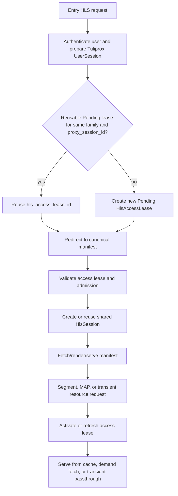
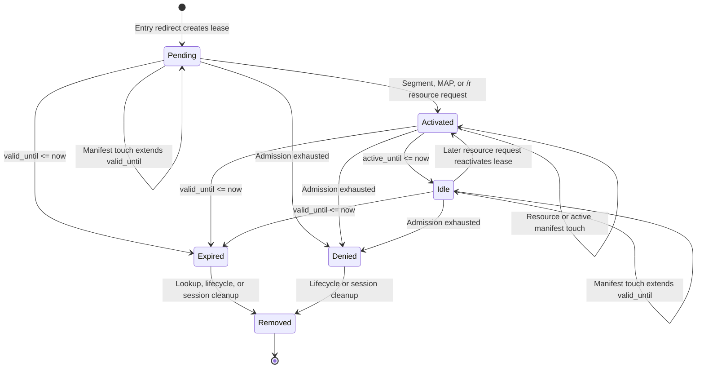
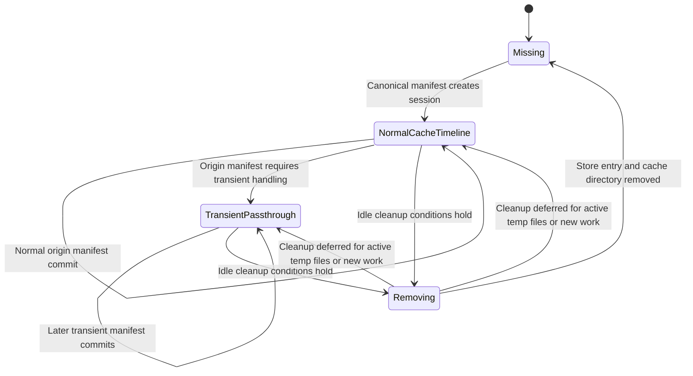
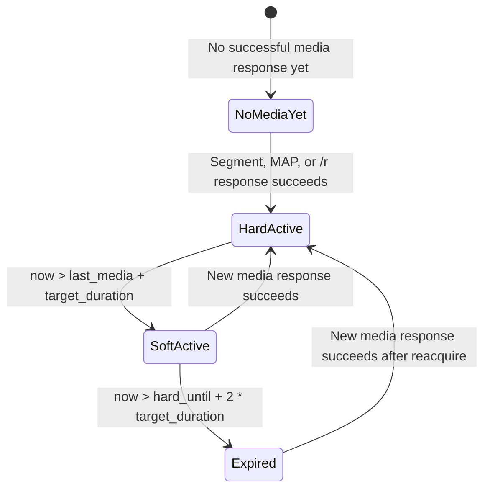
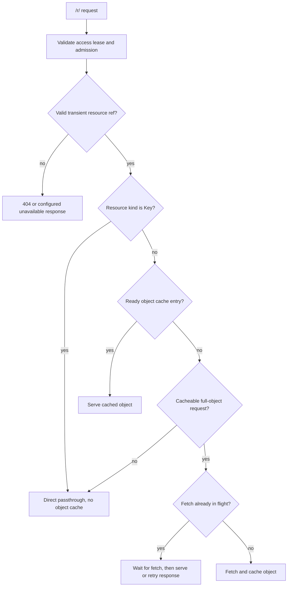

# HLS Cache State Machines

This page documents the implemented runtime states for the Live HLS cache proxy.
It focuses on the shared `HlsSession`, the user-specific `HlsAccessLease`,
and the timing rules that connect them.

The HLS cache uses three different identifiers:

| Identifier | Scope | Meaning |
| :--- | :--- | :--- |
| `HlsSessionKey` | Shared content | Stable tuple of `input_id`, `hls`, and `stream_ref`. It does not include the origin URL, provider URL, username, or password. |
| `proxy_session_id` | Shared content URL | Opaque public token derived from `HlsSessionKey` and `reverse_proxy.rewrite_secret`. |
| `hls_access_lease_id` | User access URL | Opaque lookup key for one server-side `HlsAccessLease`. It is not a shared-content identity. |

## High-Level Flow

The entry request creates or reuses a short-lived pending access lease and redirects
the player to the canonical HLS cache path. The shared content session is created
or reused by the canonical manifest request after the access lease and admission
checks have passed.



The canonical routes are:

```text
/proxy/hls/live/<proxy_session_id>/<hls_access_lease_id>/manifest.m3u8
/proxy/hls/live/<proxy_session_id>/<hls_access_lease_id>/<proxy_seq>.<ext>
/proxy/hls/live/<proxy_session_id>/<hls_access_lease_id>/map/<proxy_map_id>.<ext>
/proxy/hls/live/<proxy_session_id>/<hls_access_lease_id>/r/<transient_resource_id>.<ext>
```

## HlsAccessLease State Machine

`HlsAccessLeaseId` is only the URL lookup key. The state lives in
`HlsAccessLeaseState`.



### Access Lease Transitions

| From | To | Condition |
| :--- | :--- | :--- |
| none | `Pending` | Entry request prepares a new `HlsAccessLease` and redirects to the canonical manifest. |
| `Pending` | `Pending` | Canonical manifest validation succeeds. Manifest access does not activate the lease. |
| `Pending` | `Activated` | A segment, MAP, or transient resource request validates with `ResourceAccess`. |
| `Pending` | `Expired` | `valid_until_ms <= now_ms`, including the exact boundary. |
| `Pending` | `Denied` | Admission returns exhausted for the bound Tuliprox UserSession. |
| `Activated` | `Activated` | A resource request, or a manifest request for an already activated lease, slides the active and valid windows. |
| `Activated` | `Idle` | `active_until_ms <= now_ms` while `valid_until_ms > now_ms`. The bound UserSession stream reservation is released. |
| `Activated` | `Expired` | `valid_until_ms <= now_ms`. If it was active, the same cleanup path releases the UserSession stream reservation. |
| `Idle` | `Idle` | A valid manifest request can keep the lease entry alive without restarting media activity. |
| `Idle` | `Activated` | A later segment, MAP, or transient resource request reactivates the same lease. |
| `Idle` | `Expired` | `valid_until_ms <= now_ms`. |
| any usable state | `Denied` | Admission rejects the underlying Tuliprox UserSession as exhausted. |
| `Expired` or `Denied` | removed | Lifecycle processing, stale lookup, cache path reset, or session cleanup removes the store entry. |

Only `Pending` and `Activated` leases count as usable for background origin work.
An `Idle` lease can still validate its own manifest or resource URL, but it does
not keep prefetch or map-fetch workers active until a media request reactivates it.

## Access Lease Reuse

Entry-redirect reuse is only an idempotency window for duplicated player startup
requests. It must not collapse two real parallel playbacks onto one access lease.

A previous lease is reusable only when all conditions hold:

| Condition | Required value |
| :--- | :--- |
| `family_key` | Same user and client fingerprint family. |
| `proxy_session_id` | Same shared HLS session URL identity. |
| `state` | `Pending`. |
| age | `now_ms - issued_at_ms < 5000`. |

`last_seen_at_ms` does not extend the reuse window. Once a lease is `Activated`,
`Idle`, `Expired`, or `Denied`, a later entry request creates a new lease instead
of reusing the old one. Creating or activating a new lease does not invalidate
older leases from the same playback family.

## HlsSession State Model

`HlsSession` does not have one single `Active` or `Idle` enum. Its effective state
is composed from:

| Layer | Stored as | Meaning |
| :--- | :--- | :--- |
| Store presence | `HlsSessionStore` indexes | Whether the shared session exists. |
| Media mode | `HlsSessionMode` | Whether media is handled by the normal cache timeline or transient passthrough. |
| Activity | `HlsSessionActivity` | Last authorized manifest/media access, active lease count, origin work count, and origin work generation. |
| Origin binding | `HlsOriginAccountBindingMode` | Whether a provider account binding is active, speculative, or detached. |
| GC flag | `gc_marked_for_removal` | Temporary guard while a session is being removed. |



Session cleanup can run only when the session idle timeout has elapsed and the
session has no active origin work, segment fetches, map fetches, origin refresh,
prefetch queue entries, active cache readers, fetching segment/MAP objects, or
active transient resource readers.

## Origin Account Protection

Origin account protection is derived from the last successful media access. It is
the same for `NormalCacheTimeline` and `TransientPassthrough`.



The timing uses `#EXT-X-TARGETDURATION` when known. If the session has not parsed
one yet, the fallback target duration is 15 seconds.

| Protection state | Condition |
| :--- | :--- |
| `NoMediaYet` | No segment, MAP, or transient resource response has succeeded yet. |
| `HardActive` | `now <= last_authorized_media_at_ms + target_duration`. |
| `SoftActive` | After the hard window, until another `2 * target_duration` has elapsed. |
| `Expired` | The soft window has elapsed. |

Hard-active sessions are not candidates for speculative account overlap. Soft-active
sessions may be displaced speculatively, and the original owner may reclaim within
the soft window.

## Transient Resource Delivery

Transient passthrough uses the same access lease lifecycle and admission checks as
normal cache timeline mode. Only media object handling is different.

There are two delivery paths inside `TransientPassthrough`: cacheable full-object
resources are fetched once and served from the HLS object cache, while keys and
non-cacheable range requests use direct passthrough. Both paths run after the
same lease validation and origin account preparation.



A transient request is treated as full-object cacheable when it has no `Range`
header or exactly `Range: bytes=0-`. Other range requests use direct passthrough.
Keys always use direct passthrough. Both cached transient object fetches and direct
transient passthrough use `origin_segment_timeout_ms` for origin body reads; direct
passthrough applies it while reading upstream chunks.

## Timings

| Timing | Default | Used for |
| :--- | :--- | :--- |
| Access lease reuse window | `5000ms` | Only duplicate entry redirects may reuse a still-`Pending` lease. |
| Access lease active window | `2 * target_duration` | How long an activated lease counts as active after last activation/touch. |
| Access lease validity window | `session_idle_timeout` | How long a lease remains valid before becoming `Expired`. |
| Session idle timeout | `300s` | When a session may be collected after last authorized manifest/media access. |
| Account hard-active window | `1 * target_duration` | Provider account is protected from speculative overlap. |
| Account soft-active window | additional `2 * target_duration` | Provider account can be speculatively displaced and reclaimed. |
| Target-duration fallback | `15s` | Used before an origin manifest target duration has been parsed. |
| Origin manifest timeout | `3000ms` | Manifest origin fetch attempt timeout. |
| Manifest commit wait | `origin_manifest_timeout_ms + 250ms` | How long the canonical manifest path waits for a newly committed manifest. |
| Origin refresh interval | at least `1000ms`, fallback `2000ms` | Base interval is half of last segment duration or target duration. Successful refreshes without highwater progress apply `base * 0.5^N` down to `1000ms`; failures use the separate failure backoff. |
| Origin object body timeout | `10000ms` | Segment, MAP, transient object, and transient passthrough body reads. |
| Temporary transient retry-after | `1s` | Response for in-flight or retryable transient object cache misses. |
| HLS cache GC interval | `30s` | Background garbage collection cadence. |

Manifest timing logs include `progress=advanced|unchanged`,
`empty_refreshes=<n>`, and `next_refresh_in_s` after empty-refresh rampdown has
been applied.

## Request Effects

| Request | Validates access lease | Activates lease | Updates manifest activity | Updates media activity |
| :--- | :---: | :---: | :---: | :---: |
| Entry redirect | no existing lease required | no | no | no |
| Canonical manifest | yes | no | yes, after origin runtime is prepared | only when a committed manifest is served as playback media continuity |
| Segment | yes | yes | no | yes on `200` or `206` |
| MAP | yes | yes | no | yes on `200` or `206` |
| Transient `/r/...` resource | yes | yes | no | yes on successful response |

## Cleanup Rules

Access leases are removed when they expire, are denied and processed by lifecycle,
or when the owning `proxy_session_id` is removed. Session removal also removes
per-lease repair windows and related repair state.

Shared sessions can outlive individual user access leases as cache-only runtime
objects. They are removed only when the idle timeout and all safety conditions
allow cleanup.
