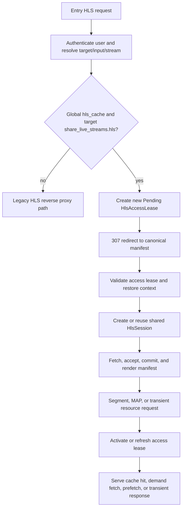
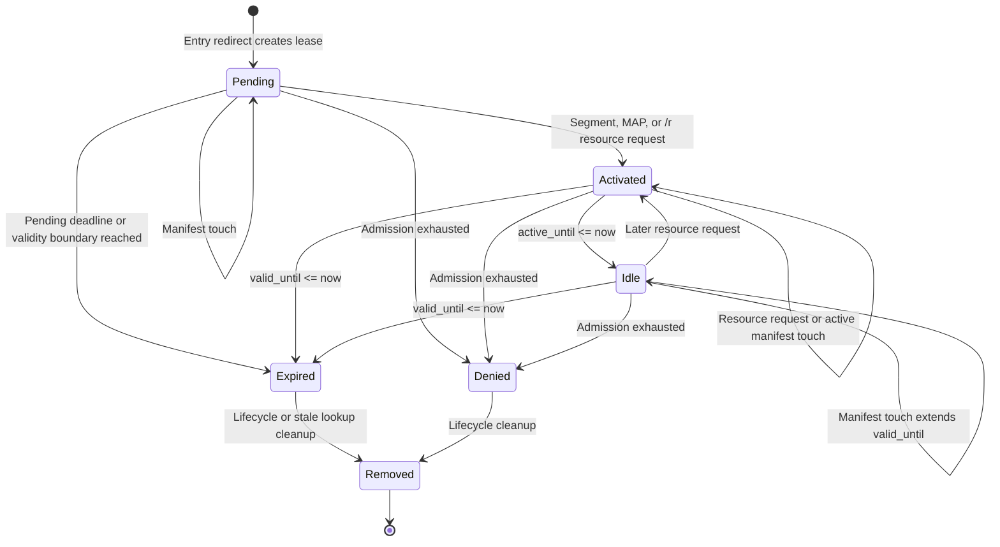
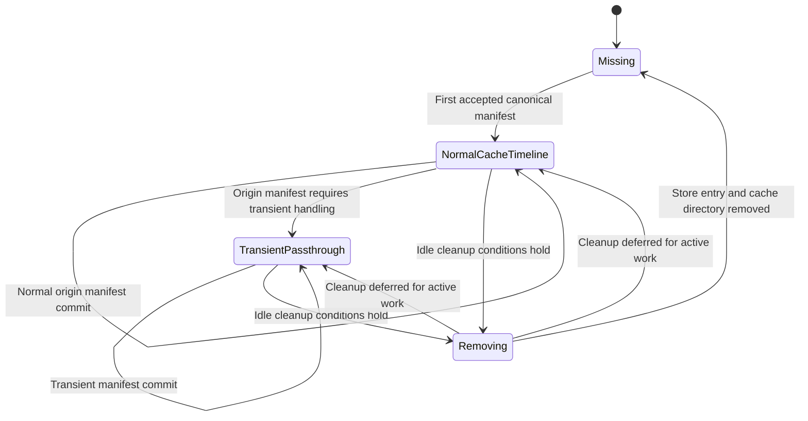

# HLS Cache State Machines

This page is the technical reference for the Live HLS cache proxy runtime states. It focuses on the shared `HlsSession`,
the per-playback `HlsAccessLease`, and the timing rules that connect them.

For an operator-friendly introduction, see [Shared HLS Sessions](./shared-hls-sessions.md). For configuration, see
[Shared HLS Configuration](./shared-hls-configuration.md).

## Contents

- [Identifiers](#identifiers)
- [High-level flow](#high-level-flow)
- [HlsAccessLease state machine](#hlsaccesslease-state-machine)
- [HlsSession state model](#hlssession-state-model)
- [Origin account protection](#origin-account-protection)
- [Manifest commit and recovery](#manifest-commit-and-recovery)
- [Segment, MAP, and transient resource delivery](#segment-map-and-transient-resource-delivery)
- [Cleanup rules](#cleanup-rules)
- [Operational timings](#operational-timings)
- [Implementation map](#implementation-map)

## Identifiers

| Identifier | Scope | Meaning |
| :--- | :--- | :--- |
| `HlsSessionKey` | Shared content | Stable tuple of `input_id`, HLS kind, and `stream_ref`. It does not include the origin URL, provider URL, username, or password. |
| `proxy_session_id` | Shared public URL identity | Opaque token derived from `HlsSessionKey` and the configured secret. It identifies the shared content session in canonical URLs. |
| `HlsPlaybackFamilyKey` | User/client family | Tuple of Tuliprox username and client fingerprint key. It groups playback attempts by user and client. |
| `hls_access_lease_id` | Per playback URL identity | Random lookup key for one server-side `HlsAccessLease`. It is not a shared-content identity. |
| HLS cache user session token | Per playback admission | Internal Tuliprox user-session token associated with an access lease. |

The public canonical paths are:

```text
/hls/shared/live/<proxy_session_id>/<hls_access_lease_id>/manifest.m3u8
/hls/shared/live/<proxy_session_id>/<hls_access_lease_id>/<segment_file>
/hls/shared/live/<proxy_session_id>/<hls_access_lease_id>/map/<map_file>
/hls/shared/live/<proxy_session_id>/<hls_access_lease_id>/r/<resource_file>
```

## High-level flow

The entry request creates a new playback-specific access lease and redirects the player to the canonical Shared HLS
manifest. The shared content session is created or reused by the canonical manifest request after access-lease validation
and admission checks have passed.



Entry redirects intentionally create distinct access leases for distinct playback starts. A later entry request for the
same user, fingerprint, and channel does not reuse an already activated lease, and existing pending leases are not used as
the identity for a new playback.

## HlsAccessLease state machine

`HlsAccessLeaseId` is only the URL lookup key. The lifecycle state lives in `HlsAccessLeaseState`.



### Access lease transitions

| From | To | Condition |
| :--- | :--- | :--- |
| none | `Pending` | Entry request prepares a new access lease and redirects to the canonical manifest. |
| `Pending` | `Pending` | Canonical manifest validation succeeds. Manifest access alone does not activate the lease. |
| `Pending` | `Activated` | Segment, MAP, or transient `/r` resource request validates with resource access. |
| `Pending` | `Expired` | The pending deadline or validity boundary is reached. The boundary is inclusive. |
| `Pending` | `Denied` | Admission returns exhausted for the bound Tuliprox user session. |
| `Activated` | `Activated` | Media access or an active manifest touch slides the active and valid windows. |
| `Activated` | `Idle` | `active_until_ms <= now_ms` while `valid_until_ms > now_ms`. The bound stream reservation is released. |
| `Activated` | `Expired` | `valid_until_ms <= now_ms`. Cleanup releases the stream reservation if it is still active. |
| `Idle` | `Idle` | A valid manifest request extends `valid_until_ms` without restarting media activity. |
| `Idle` | `Activated` | A later segment, MAP, or transient resource request reactivates the lease. |
| `Idle` | `Expired` | `valid_until_ms <= now_ms`. |
| any usable state | `Denied` | Admission rejects the underlying user session as exhausted. |
| `Expired` or `Denied` | removed | Lifecycle processing, stale lookup, cache path reset, or session cleanup removes the entry. |

### Lease effects on origin work

| Lease state | Can validate own URL? | Counts as active viewer? | Contributes effective origin policy? |
| :--- | :---: | :---: | :---: |
| `Pending` | Yes | No | Yes |
| `Activated` | Yes | Yes | Yes |
| `Idle` | Yes | No | No |
| `Expired` | No | No | No |
| `Denied` | No | No | No |

A session snapshot counts `Activated` leases as active. It uses `Pending` and `Activated` leases to derive the effective
origin acquire policy. `Idle` leases can still recover their own playback path if a later media request arrives before
validity expires, but they do not keep prefetch work active.

## HlsSession state model

`HlsSession` is not represented by one single lifecycle enum. Its effective state is composed from several layers.

| Layer | Stored as | Meaning |
| :--- | :--- | :--- |
| Store presence | HLS session store indexes | Whether the shared session exists. |
| Session identity | `HlsSessionKey` and `proxy_session_id` | Stable shared-content identity. |
| Media mode | `HlsSessionMode` | Normal cache timeline or transient passthrough. |
| Activity | `HlsSessionActivity` | Last authorized manifest/media access, active lease count, active origin work count, and work generation. |
| Origin binding | Origin account binding state | Provider account/session owner binding for upstream work. |
| Cache state | Segment, MAP, transient object maps | Ready, fetching, failed, and temporary object state. |
| GC flag | `gc_marked_for_removal` | Guard used while session cleanup is in progress. |



### Session modes

| Mode | Meaning |
| :--- | :--- |
| `NormalCacheTimeline` | Tuliprox parses the origin manifest into a shared timeline and serves segment/MAP URLs through the HLS cache. |
| `TransientPassthrough` | Tuliprox detected a manifest feature that needs controlled transient resource handling, such as certain key resources or unsupported tags. |

## Origin account protection

Origin account protection is derived from the most recent successful media response. Manifest-only activity is not enough
to mark a session as media-active.


| Protection state | Condition |
| :--- | :--- |
| `NoMediaYet` | No segment, MAP, or transient resource response has succeeded yet. |
| `HardActive` | Current time is inside the hard-active window after the last authorized media access. |
| `SoftActive` | Hard-active protection elapsed, but the soft overlap window has not elapsed. |
| `Expired` | The soft overlap window elapsed. |

The timing uses the parsed `#EXT-X-TARGETDURATION` when known. If no target duration is available, Tuliprox uses a
15-second fallback.

Hard-active sessions are not soft-overlap candidates. Soft-active sessions may be displaced speculatively only when the
runtime account-capacity and cooldown checks allow it. If the original owner returns during the reclaim window, it can
reclaim the binding and the account enters an overlap cooldown.

## Manifest commit and recovery

After access-lease validation, the canonical manifest path may fetch an origin manifest and decide whether it can advance
the shared session.

The manifest commit policy tracks multiple signals:

| Signal | Purpose |
| :--- | :--- |
| Media sequence and visible segment range | Avoids regressive manifests and invalid jumps. |
| Effective origin host | Avoids unsafe host switches while allowing controlled redirect host pinning. |
| Target duration and segment durations | Drives refresh timing, lease active windows, and startup behavior. |
| Failure counters | Separates temporary origin failures from hard failures that require a fresh commit. |
| Recovery requirements | Forces fresh manifest decisions during cold start, expired revalidation, hard failures, and provisioning handoff. |

A successful commit renders a visible manifest window and queues prefetch work up to `max_segments_prefetch`, subject to
per-session and global fetch limits.

Manifest recovery burst is configured by `hls_cache.manifest_recovery_burst.level`. Keep it `off` unless logs show that
manifest recovery needs additional pressure.

## Segment, MAP, and transient resource delivery

### Segment objects

A segment request validates the access lease and then looks up the segment object in the shared session timeline.

| Object state | Typical response |
| :--- | :--- |
| Ready | Serve from cache, including supported range responses. |
| Known but not ready | Wait briefly or return `503` with `Retry-After`. |
| Missing from session timeline | Return an unavailable/expired response depending on context. |
| Temporary failures below threshold | Keep retrying according to internal retry behavior. |
| Temporary failure threshold reached | Mark usable access leases channel-unavailable. |
| Permanent failure | Mark affected leases channel-unavailable. |

### MAP objects

MAP resources use the shared session MAP table and the same access-lease validation model. They are cached and protected
similarly to segments.

### Transient resources

Transient resources are exposed through `/r/<resource_file>` URLs. They are request-controlled and access-lease protected.
They are used when the origin manifest contains resources that should not be modeled as normal cached timeline objects.

## Cleanup rules

Access lease cleanup and session cleanup are separate.

An access lease is removed when it expires, is denied, is stale during lookup, or is removed as part of broader session or
runtime cleanup.

A shared session can be removed only when the idle timeout has elapsed and the session has no active work that would make
cleanup unsafe.

Cleanup must wait for:

- active access leases;
- active origin work;
- active origin manifest refresh;
- active segment fetches;
- active MAP fetches;
- prefetch queue entries;
- ready object readers;
- fetching objects;
- active transient resource readers;
- temporary files that still need cleanup.

Changing the configured HLS cache path clears HLS runtime state because existing sessions and cache object handles point at
the old location.

## Operational timings

| Timing | Value or source | Purpose |
| :--- | :--- | :--- |
| Initial pending bootstrap window | 90 seconds | Allows first useful manifest decision during cold start or required fresh commit. |
| Pending follow-up window | `max(10 seconds, 2 * target_duration)` | Shortens a pending lease after a manifest response. |
| Access lease active window | `2 * target_duration` | Keeps a media-active lease active after resource access. |
| Access lease valid window | `hls_cache.session_idle_timeout` | Keeps the lease valid before expiry. Default: 300 seconds. |
| Target duration fallback | 15 seconds | Used before an origin target duration is known. |
| HLS cache GC interval | 30 seconds | Periodic cleanup cadence for cache objects and stale runtime state. |
| Temporary file retention | 30 seconds | Retention window for temporary HLS cache files. |
| Failed segment retention | 10 seconds | Short retention for failed segment state. |
| Origin manifest timeout | `hls_cache.origin_manifest_timeout_ms` | Upstream manifest fetch timeout. Default: 3000 ms. |
| Origin segment timeout | `hls_cache.origin_segment_timeout_ms` | Upstream segment fetch timeout. Default: 10000 ms. |

## Implementation map

| Area | Main implementation files |
| :--- | :--- |
| Public routes and request handling | `backend/src/api/endpoints/hls_api.rs` |
| Access lease model and store | `backend/src/api/model/hls_cache/lease.rs` |
| Shared session model | `backend/src/api/model/hls_cache/session.rs` |
| Session manager, lifecycle, runtime config | `backend/src/api/model/hls_cache/manager.rs` |
| Session identity | `backend/src/api/model/hls_cache/ids.rs` |
| Origin account binding/protection | `backend/src/api/model/hls_cache/origin.rs` |
| Manifest refresh and render | `backend/src/api/model/hls_cache/refresh.rs`, `renderer.rs`, `timeline.rs` |
| Segment and MAP fetching | `segment_fetcher.rs`, `map_fetcher.rs` |
| Transient resource handling | `transient.rs` |
| Cache and cleanup | `cache.rs`, `gc.rs` |
| Config DTO and validation | `shared/src/model/config/reverse_proxy.rs`, `shared/src/model/config/target.rs` |
