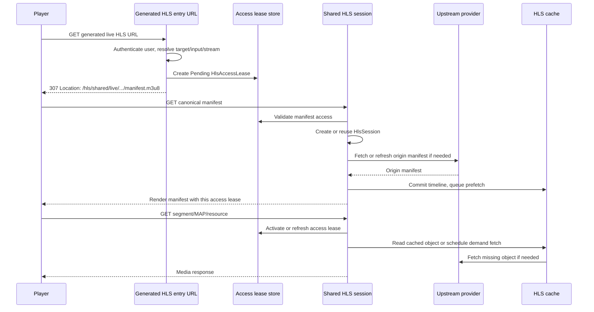
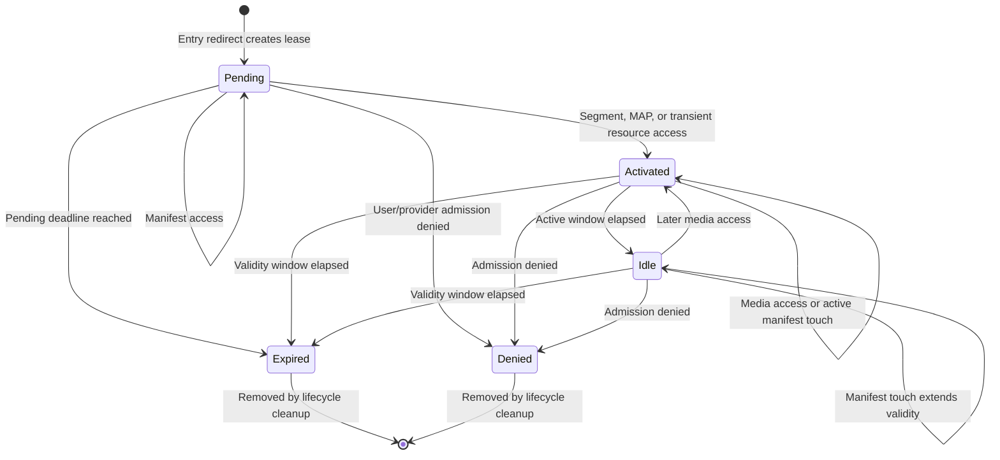
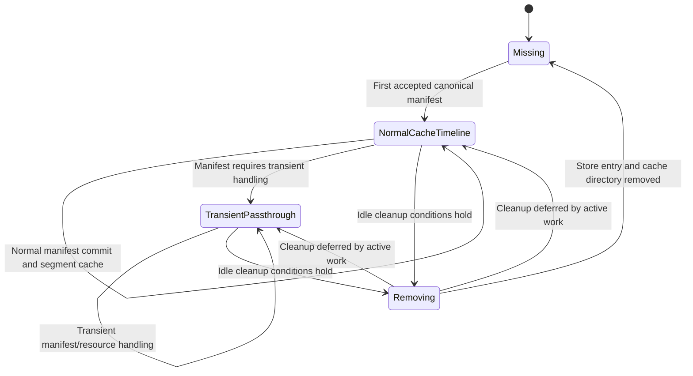

# Shared HLS Runtime Flow

This page explains what happens after a player opens a live HLS URL on a target that has Shared HLS enabled.

For the operator setup, see [Shared HLS Configuration](./shared-hls-configuration.md). For the compact state-machine
reference, see [HLS Cache State Machines](./hls-cache-state-machine.md).

## Important identifiers

| Identifier | Scope | Created by | Purpose |
| :--- | :--- | :--- | :--- |
| `HlsSessionKey` | Shared content | Built from `input_id`, the literal HLS kind, and `stream_ref`. | Stable internal key for one shared live HLS session. It does not include provider username, password, or origin URL. |
| `proxy_session_id` | Public shared content URL | Derived from `HlsSessionKey` and the configured secret. | Opaque URL token for the shared session. The same input and stream reference produce the same public session ID while the secret stays stable. |
| `HlsPlaybackFamilyKey` | Playback family | Built from Tuliprox username and client fingerprint. | Groups related playback attempts by user and client. |
| `hls_access_lease_id` | Per playback URL | Random server-side lease ID. | Lets exactly one playback path use the shared session after Tuliprox validates the user and lease. |
| HLS cache user session token | Per playback admission | Generated for the Shared HLS entry request. | Connects the access lease to Tuliprox user session accounting and connection handling. |

The key design point is that `proxy_session_id` is shared, but `hls_access_lease_id` is not.

## End-to-end request flow



## Step 1: Entry request

The player first opens a generated Tuliprox live HLS URL. Tuliprox resolves the target, input, virtual ID, stream URL, and
user connection permission.

If Shared HLS is enabled for the target, Tuliprox creates a fresh `Pending` `HlsAccessLease` for this playback and returns
an HTTP `307 Temporary Redirect` to the canonical shared manifest path:

```text
/hls/shared/live/<proxy_session_id>/<hls_access_lease_id>/manifest.m3u8
```

The redirect response uses `Cache-Control: no-store`, because the lease ID is user-specific and should not be cached by a
browser, proxy, or IPTV client.

## Step 2: Canonical manifest request

The player follows the redirect and requests the canonical manifest. Tuliprox validates the access lease, restores the
user context, checks admission, then creates or reuses the shared `HlsSession` for the `proxy_session_id`.

A manifest request can keep a lease alive, but it does not necessarily prove active playback. For that reason, a manifest
request for a `Pending` lease usually keeps it pending. Media requests are what activate the lease.

The manifest response is rendered with the current `hls_access_lease_id` inserted into segment, MAP, and transient
resource URLs. This is how Tuliprox keeps the shared content session while preserving per-user access control.

## Step 3: Segment, MAP, and resource requests

The player then requests media URLs from the rendered manifest:

```text
/hls/shared/live/<proxy_session_id>/<hls_access_lease_id>/<segment_file>
/hls/shared/live/<proxy_session_id>/<hls_access_lease_id>/map/<map_file>
/hls/shared/live/<proxy_session_id>/<hls_access_lease_id>/r/<resource_file>
```

For these requests, Tuliprox validates the lease again and activates or refreshes it. A valid resource request moves the
lease to `Activated`, extends its active window, and extends its validity window.

Tuliprox serves the object from one of these paths:

| Path | When used |
| :--- | :--- |
| Ready cache hit | The segment or MAP object is already committed and readable. |
| Demand fetch | The manifest references an object that is known but not ready yet. |
| Prefetch | Background work fetches likely next segments after a manifest commit. |
| Transient passthrough | The manifest contains a resource that cannot be handled as a normal cached timeline object. |

Range requests are supported for ready cached objects. This matters for clients that seek or reconnect inside an HLS
segment.

## Access lease lifecycle



Important timing rules:

| Rule | Meaning |
| :--- | :--- |
| Initial pending bootstrap window | A newly redirected lease can wait for the first useful manifest decision. The current bootstrap window is 90 seconds. |
| Pending follow-up window | After a pending manifest response, Tuliprox can shorten the pending window to `max(10 seconds, 2 * target_duration)`. |
| Active window | A media request keeps a lease active for `2 * target_duration`. If target duration is unknown, Tuliprox uses a 15-second fallback. |
| Validity window | The lease validity baseline comes from `hls_cache.session_idle_timeout`. Default: 300 seconds. |

An `Idle` lease can still validate its own URL, but it does not keep origin prefetch work active until a later media
request reactivates it.

## Shared session lifecycle

`HlsSession` is a composite runtime object rather than a single `Active` enum. Its effective state comes from store
presence, media mode, access leases, origin work, cache readers, and the garbage-collection marker.



A session can be removed only when all relevant work has drained:

- no active access lease keeps it alive;
- no origin manifest refresh is active;
- no segment or MAP fetch is active;
- no prefetch queue entries are pending;
- no ready object has an active reader;
- no transient resource reader is active;
- no temporary files block cleanup.

## Manifest commit and startup rendering

Tuliprox uses the origin manifest to build a shared internal timeline. A rendered user manifest contains only the visible
window and user-specific access-lease URLs.

Startup rendering can apply `hls_cache.strip` to hold back the initial view. This can help players that behave poorly when
they start too close to the live edge.

Manifest acceptance is conservative. Tuliprox tracks media sequence progress, host changes, and recovery signals so it can
avoid accepting a manifest that would move the shared session backwards or suddenly switch to an unsafe origin host.

## Origin account binding

The shared session can hold an origin account binding. That binding represents the provider account or provider connection
Tuliprox uses for origin work.

Origin account protection is based on successful media access:

| Protection state | Meaning |
| :--- | :--- |
| `NoMediaYet` | No segment, MAP, or transient resource response has succeeded yet. |
| `HardActive` | Recent media access is still inside the hard-active window. |
| `SoftActive` | The hard window has elapsed, but the session is still inside the soft overlap window. |
| `Expired` | The soft window elapsed and the binding is no longer protected by recent media activity. |

Upgrades to the effective origin policy apply immediately. Downgrades or clearing the policy wait for a target-duration
based grace window so active playback is not destabilized by a short pause or by brief client behavior differences.

## Transient passthrough flow

Some manifests contain objects that should not become normal cached timeline segments. Examples include certain key
resources or unsupported HLS features.

When Tuliprox detects such a manifest, the session can switch from `NormalCacheTimeline` to `TransientPassthrough`.
The rendered manifest then points user-specific `/r/<resource_file>` URLs at short-lived transient resource entries.
Tuliprox still validates the `hls_access_lease_id` before serving those resources.

## Cleanup and stale URLs

A player may keep old HLS URLs after a pause, device sleep, app restart, or network change. When the corresponding access
lease or session is gone, the old URL no longer represents a valid server-side object.

Typical outcomes are:

- a redirect to the `hls_session_or_lease_expired` custom video;
- `404 Not Found` for a stale shared HLS path;
- `503 Service Unavailable` with `Retry-After` when origin/cache work is temporarily not ready.

Players should reopen the original generated playlist entry URL when they recover from a long pause or stale HLS path.
