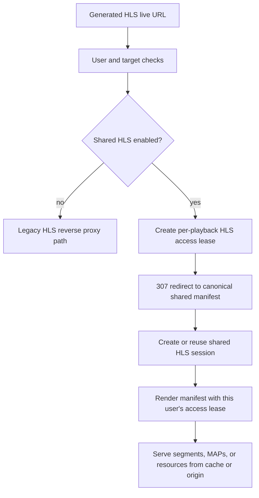

# Shared HLS Sessions

Shared HLS Sessions let several viewers watch the same live HLS channel through one shared Tuliprox HLS cache session.
This reduces duplicated upstream traffic and lowers the chance of hitting provider connection limits, while each viewer
still keeps their own Tuliprox user access lease.

This page is the recommended starting point for operators who are new to the feature. For every available setting, see
[Shared HLS Configuration](./shared-hls-configuration.md). For internal state machines, see
[HLS Cache State Machines](./hls-cache-state-machine.md).

## What problem does this solve?

A live HLS stream is not one long connection. It is a playlist file, usually called a manifest, plus many small media
files, usually called segments.

Without sharing, every viewer can cause Tuliprox to fetch the same manifest and the same segment files from the upstream
provider. With Shared HLS Sessions, Tuliprox creates one shared server-side HLS session for the same live channel and
serves the users from that shared session whenever possible.

A simple analogy:

| Concept | Everyday analogy | Meaning in Tuliprox |
| :--- | :--- | :--- |
| `HlsSession` | One cinema screen | The shared live HLS cache session for one channel. |
| `HlsAccessLease` | One ticket | The per-viewer permission to use that shared session. |
| Provider account binding | The cinema’s source feed | The upstream account/connection Tuliprox uses to fetch the live channel. |
| HLS cache | Local snack counter | Segment and MAP files Tuliprox can serve locally after fetching them once. |

## When should I enable it?

Enable Shared HLS Sessions when these statements are true:

- the stream type is live HLS;
- multiple users may watch the same channel at the same time;
- the provider limits simultaneous connections or penalizes frequent account switching;
- clients can follow HTTP redirects and play normal HLS playlists;
- Tuliprox reverse proxy mode is used instead of direct provider URLs.

Do not expect this feature to share VOD, series, catchup, or MPEG-TS streams. MPEG-TS stream sharing is controlled by the
separate `share_live_streams.mpeg_ts` option.

## What is shared and what is still per user?

| Shared between viewers | Still separate per viewer |
| :--- | :--- |
| The stable `HlsSession` for the same input and original input stream ID. | The `hls_access_lease_id` in the user-facing URL. |
| Origin manifest refreshes and origin segment fetches when the cache can reuse them. | Tuliprox username, client fingerprint, and access checks. |
| Cached HLS segments and HLS MAP objects. | User connection admission and stream reservation lifecycle. |
| Transient HLS resource handling when the manifest requires it. | User-visible error handling and custom video redirects. |

This means the feature is not a bypass for user limits. It is a way to avoid duplicated upstream HLS work after Tuliprox
has accepted each viewer.

## How is a shared session identified?

Tuliprox builds the shared content identity as:

```text
input:<input_id>|hls|<input_stream_id>
```

`input_id` identifies the configured Tuliprox input. `input_stream_id` is the original stream ID captured from the input
playlist item before target mapping. For Xtream inputs, it is the provider/origin stream ID rendered as a decimal string.
For M3U inputs, it is the exact ID resolved by the parser, which can also be alphanumeric or a stable URL-derived hash.

The target ID and `virtual_id` are not part of this key. Consequently, two targets with different virtual IDs share the
same content session when they refer to the same `input_id` and `input_stream_id`. Their access leases, routing context,
and user admission remain separate. Origin credentials, direct origin URLs, and the currently selected provider mirror
also do not change the shared session identity.

The pair `(input_id, input_stream_id)` must uniquely identify one stream within the processed inputs. Target mapping must
not change the captured input stream ID.

## Requirements

Shared HLS starts only when both switches are enabled:

1. `reverse_proxy.hls_cache` exists in `config.yml`.
2. The target has `options.share_live_streams.hls: true` in `source.yml`.

A stable `reverse_proxy.rewrite_secret` is strongly recommended. Changing the secret changes future public HLS session
IDs and transient resource IDs, so existing player URLs may stop matching server-side runtime state.

The cache directory must be writable by the Tuliprox process and must have enough free disk space for the configured HLS
cache budgets.

## Minimal configuration

`config.yml`:

```yaml
reverse_proxy:
  rewrite_secret: "00112233445566778899aabbccddeeff"
  hls_cache:
    cache_path: "/var/lib/tuliprox/cache/hls"
    cache_bytes: "10GB"
    cache_bytes_per_session: "512MB"
    session_idle_timeout: 300
```

`source.yml`:

```yaml
targets:
  - name: xc_m3u
    output:
      - type: xtream
      - type: m3u
    options:
      share_live_streams:
        hls: true
        mpeg_ts: false
```

`share_live_streams.hls` and `share_live_streams.mpeg_ts` are independent. Use the object form shown above. The old style
`share_live_streams: true` is not valid for this configuration shape.

## Request flow in plain language

1. A player opens the normal generated Tuliprox HLS live URL.
2. Tuliprox authenticates the user, resolves the unchanged input stream ID, and checks whether this target allows Shared
   HLS.
3. Tuliprox creates a new access lease for that playback.
4. Tuliprox returns an HTTP `307 Temporary Redirect` to the canonical shared HLS manifest URL.
5. The player follows the redirect and requests `/hls/shared/live/.../manifest.m3u8`.
6. Tuliprox creates or reuses the shared `HlsSession` for the live channel.
7. The player requests segments, MAP files, or transient resources through the same access lease.
8. Segment and MAP requests activate or refresh the lease. When the player stops, the lease idles and is later removed.
9. When no usable lease and no origin/cache work remain, the shared session is eligible for cleanup.



Canonical Shared HLS URLs look like this:

```text
/hls/shared/live/<proxy_session_id>/<hls_access_lease_id>/manifest.m3u8
/hls/shared/live/<proxy_session_id>/<hls_access_lease_id>/<segment_file>
/hls/shared/live/<proxy_session_id>/<hls_access_lease_id>/map/<map_file>
/hls/shared/live/<proxy_session_id>/<hls_access_lease_id>/r/<resource_file>
```

The `proxy_session_id` identifies the shared content session. The `hls_access_lease_id` identifies one viewer’s
server-side access lease.

## What happens when the player pauses or stops?

A lease can be `Pending`, `Activated`, `Idle`, `Expired`, or `Denied`.

Manifest requests alone do not necessarily mean that a user is actively watching media. Segment, MAP, and transient
resource requests are the stronger signal that playback is active. Once a lease no longer receives active media requests,
it can move to `Idle`. After the configured validity window, it becomes `Expired` and is removed.

The shared `HlsSession` survives as long as it still has usable leases or active origin/cache work. This avoids deleting a
session while another user is still watching or while Tuliprox is still finishing cache work.

## How provider connections are protected

Shared HLS cooperates with Tuliprox connection handling:

- user admission is still checked per viewer;
- the shared origin session can reuse a provider account binding for the same HLS session owner;
- soft or low-priority connections can still be denied or preempted according to the connection policy;
- hard-active sessions are protected from speculative account reuse;
- soft-active sessions may be candidates for controlled overlap only when the runtime determines it is safe.

For the broader connection-handling model, see [Connection Handling](./connection-handling.md).

## Cache behavior

Tuliprox stores HLS segment and MAP cache objects below `reverse_proxy.hls_cache.cache_path`. The cache is bounded by:

- `cache_bytes`, the global HLS cache budget;
- `cache_bytes_per_session`, the per shared-session budget;
- `cache_duration`, the retention baseline for unprotected objects;
- active reader and origin-work protection, so files are not removed while in use.

The HLS cache is separate from `reverse_proxy.cache`, which is used for logos, images, and other rewritten resources.

## Transient passthrough mode

Some HLS manifests contain resources that cannot safely be represented as normal cached timeline segments. Examples are
certain encryption-key resources or unsupported HLS tags. In those cases, Tuliprox can switch the session into transient
passthrough mode.

In transient mode, Tuliprox still validates the user’s access lease. It then fetches and serves the needed resource
through a short-lived, controlled resource path instead of pretending that the resource is a normal cached segment.

## User-visible fallback behavior

When a Shared HLS request can no longer be served, Tuliprox either returns a direct HTTP error or redirects to a configured
custom video, depending on the failure phase.

Common custom-video cases include:

| Situation | Typical user-facing result |
| :--- | :--- |
| User connection limit exhausted | `user_connections_exhausted` custom video. |
| Provider account limit exhausted | `provider_connections_exhausted` custom video. |
| Low-priority stream preempted | `low_priority_preempted` custom video. |
| Shared HLS session or lease expired | `hls_session_or_lease_expired` custom video. |
| Origin manifest or media becomes unavailable | `channel_unavailable` custom video. |

For practical debugging steps, see [Shared HLS Troubleshooting](./shared-hls-troubleshooting.md).

## Operator checklist

Before enabling Shared HLS for a target:

- set a stable 32-character hex `reverse_proxy.rewrite_secret`;
- add `reverse_proxy.hls_cache` to `config.yml`;
- use a cache path that survives restarts if you want fewer cold starts;
- make sure the Tuliprox process can create and delete files in the cache path;
- enable `options.share_live_streams.hls: true` only on targets that should use Shared HLS;
- start with the default HLS cache limits, then tune only after observing real traffic;
- watch logs for `HLS session created`, `HLS session reused`, and `HLS access lease rejected`.
