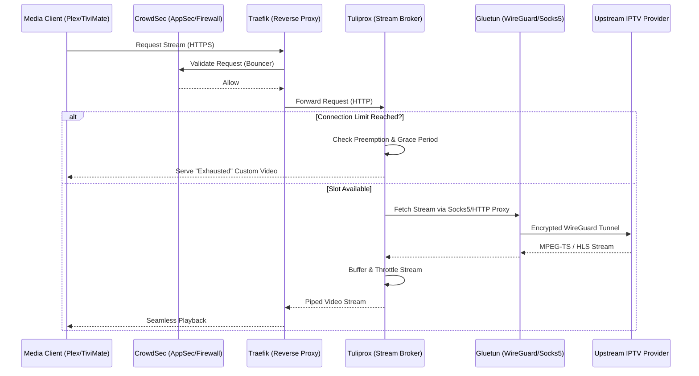

# 📖 Tuliprox Operator Manual: Introduction & Architecture

Welcome to the **Tuliprox Operator Manual**.

**Tuliprox** is a highly optimized, resource-efficient IPTV proxy and playlist processor written in Rust 🦀. It acts as an intelligent middleware
layer between your upstream IPTV providers (or local hard drives) and your local media clients (Plex, Jellyfin, Emby, Kodi, TiviMate, etc.).

## System Architecture

To ensure maximum performance and a modern user experience, Tuliprox consists of three core components:

* **Rust Backend:** A high-performance, asynchronous engine handling stream brokering, authentication, and playlist processing.
* **Yew/WebAssembly Frontend:** A reactive, browser-based management interface compiled to WASM for near-native performance.
* **Static Assets:** All necessary resources are served directly from the configured web root, making the deployment self-contained and easy to proxy.

## Why Tuliprox?

Unlike simple scripts that merely perform text replacement on M3U files (such as m3u4u or xTeVe), Tuliprox is a full-fledged **Runtime Stream Broker**.
It actively intercepts video traffic, negotiates connections with providers, protects your accounts from bans, and enhances metadata locally.

Most IPTV providers restrict access via a strict `max_connections` limit. When users fast-forward, rewind, or rapidly switch channels in modern
IPTV players (like VLC or TiviMate), "ghost connections" are often created. The provider sees multiple active streams from the same IP, leading to
immediate HTTP 509 (Bandwidth Exceeded) errors or account bans.

Tuliprox solves this through a highly complex **Reverse-Proxy Streaming Engine**:

1. **Session Holding (HLS/Catchup):** Tuliprox artificially holds provider slots open while the client negotiates or switches between `.m3u8`
   segments, preventing "account hopping" bans.
2. **Grace Periods:** It mitigates the "VLC seek problem" by granting temporary grace periods, holding the video stream back until old connections
   to the provider are safely terminated.
3. **Shared Streams:** If multiple users watch the same live event, Tuliprox opens only *one* connection to the upstream provider and multicasts the
   traffic locally to all clients, saving valuable provider slots and bandwidth.
4. **Preemption (Priority Routing):** You can assign priorities to users. If all provider slots are occupied, Tuliprox automatically kicks the least
   important user (e.g., a background metadata scan or a user with priority 100) to free up the stream for an admin (priority 0).

Tuliprox downloads raw lists from the provider, stores them in lightning-fast, local **B+Tree databases** (to save RAM).

To perfectly prepare playlists for tools like Plex or Jellyfin, metadata (covers, release years, TMDB IDs, video codecs) is often missing from
provider sources.
Tuliprox dispatches asynchronous worker tasks for **Metadata Enrichment**:

* Parse titles locally (via PTT - Parse Torrent Title) to extract release years.
* Query the **TMDB API** to fetch high-resolution covers, backdrops, and cast information.
* Utilize local **FFprobe** to look directly into the provider's stream to extract precise technical data like Codecs (HEVC, H264), HDR formats
  (Dolby Vision), and Audio Channels (5.1).

## Network Flow Architecture

Tuliprox integrates seamlessly into modern DevSecOps environments. Here is a high-level view of a recommended production stack (which we cover
extensively in the *Examples, Recipes & Ecosystem Stacks* chapter):

## Documentation map

This Operator Manual will guide you through every single configuration variable to help you extract the maximum potential from this engine.

* [Build & Deploy](./build-and-deploy.md)
* **[Installation](./installation.md)**
* [REST API Cookbook](./rest-api-cookbook.md)
* **[Configuration Overview](./configuration/overview.md)**
  * [Main Config](./configuration/config.md)
    * [Streaming & Proxy Behavior](./configuration/reverse-proxy.md)
    * [Metadata Update & Probe](./configuration/metadata-update.md)
    * [Local Library](./configuration/local-library.md)
  * [Sources & Targets](./configuration/source.md)
  * [API Proxy](./configuration/api-proxy.md)
  * [Templates](./configuration/template.md)
  * [Mapping](./configuration/mapping-dsl.md)
* **[Examples & Recipes](./examples-recipes.md)**
* [Operations & Debugging](./operations-debugging.md)
* [Troubleshooting & Resilience](./troubleshooting.md)
